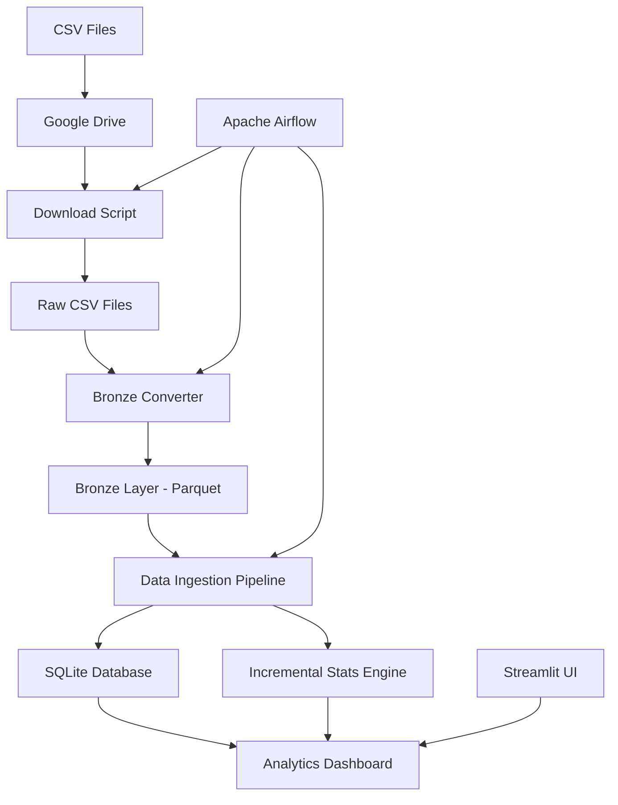
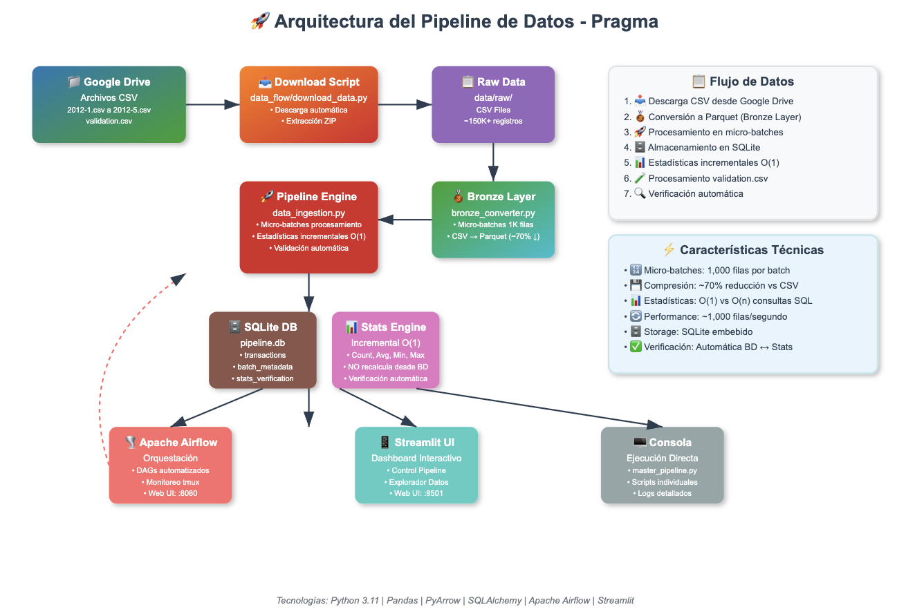
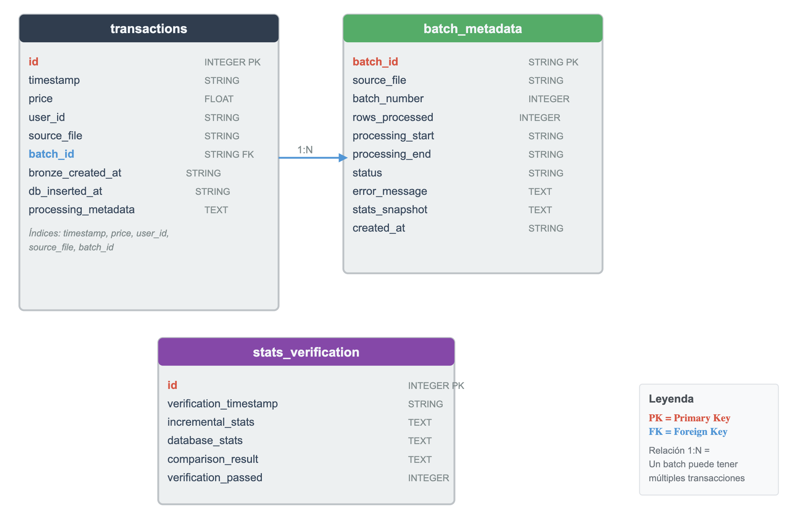
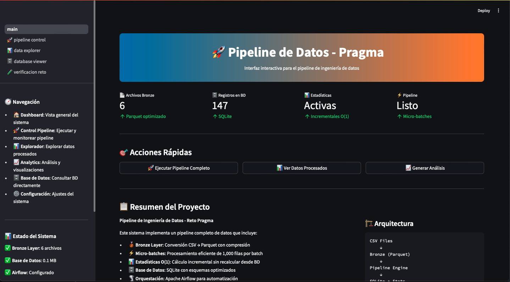
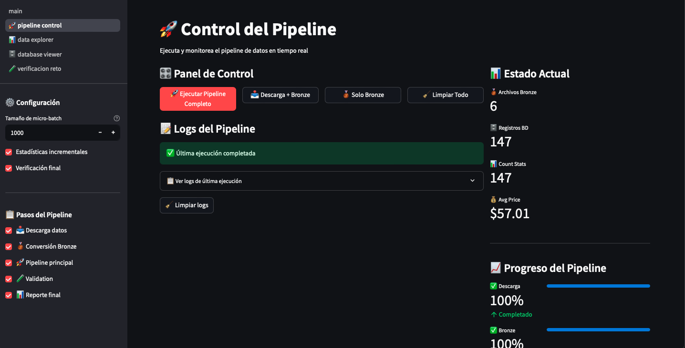
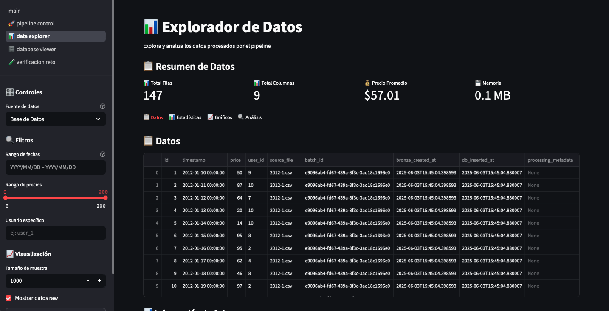
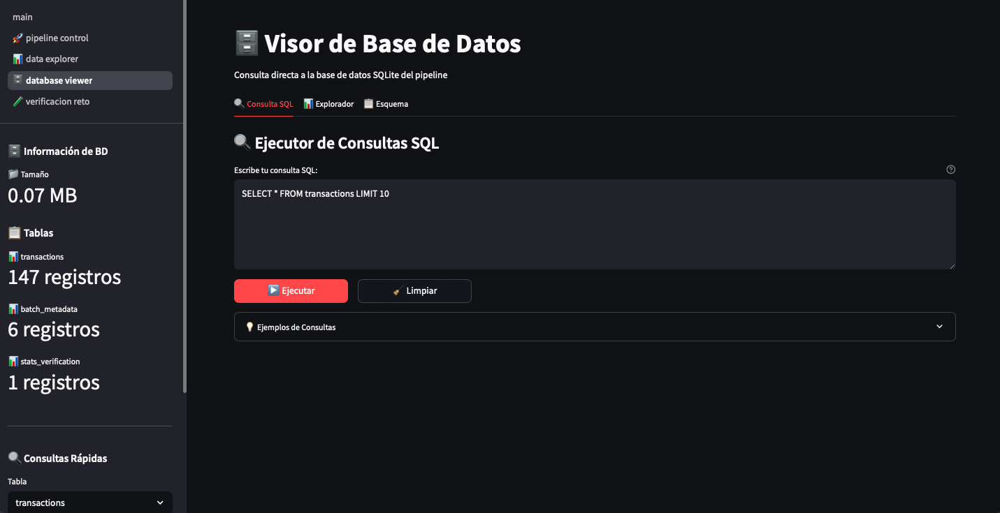
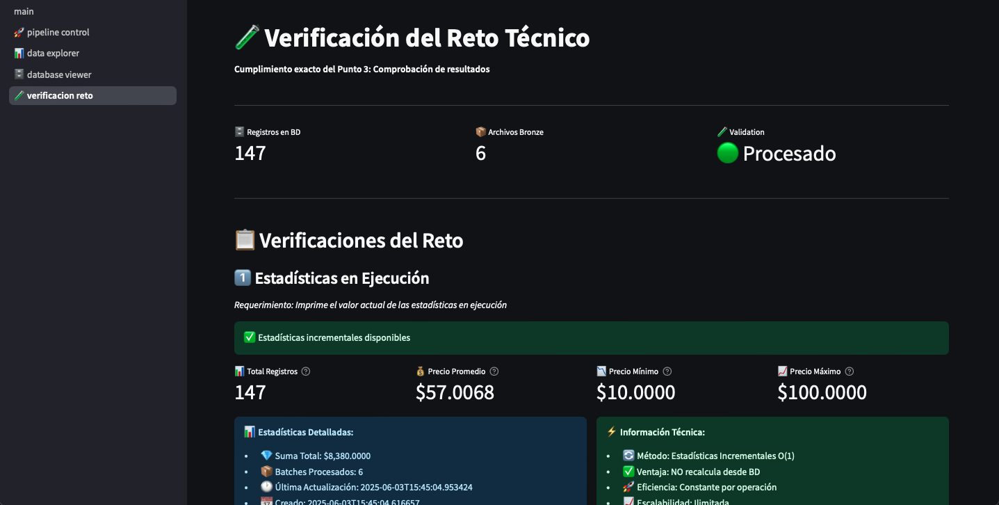

# Pipeline de Ingeniería de Datos con Arquitectura Medallion

Pipeline completo de ingeniería de datos que implementa una arquitectura medallion con estadísticas incrementales O(1) para el procesamiento eficiente de datos de transacciones. El sistema descarga, procesa y analiza archivos CSV usando micro-batches y mantiene estadísticas en tiempo real sin recalcular desde la base de datos.

<div align="center">
    <p>
        
        
        
    </p>
</div>

## 🤖 Desarrollo Asistido por IA
Este proyecto fue desarrollado con la asistencia de Claude (Anthropic) como herramienta de ingeniería de software, quien contribuyó significativamente en las pruebas requeridas, implementación de buenas prácticas y optimización del código.

## ✨ Características Principales

- 🥉 **Arquitectura Medallion**: Bronze layer con formato Parquet optimizado
- ⚡ **Micro-batches**: Procesamiento de 1,000 filas por batch para eficiencia de memoria
- 📊 **Estadísticas O(1)**: Motor incremental que no recalcula desde base de datos
- 🌪️ **Orquestación**: Apache Airflow para automatización
- 📱 **Interfaz Web**: Dashboard interactivo con Streamlit
- 🗄️ **SQLite**: Base de datos embebida con esquemas optimizados
- 🔍 **Verificación**: Comparación automática estadísticas vs consultas directas

## 🏗️ Arquitectura



## 🛠️ Requisitos del Sistema

### Software Requerido

- Python 3.11+
- Git
- tmux (para Airflow)

### Dependencias Python

```bash
# Core dependencies
pandas>=2.0.0
pyarrow>=12.0.0
sqlalchemy>=1.4.36
apache-airflow==2.8.4
streamlit==1.45.1
```

## 🚀 Instalación

### 1. Clonar el Repositorio

```bash
git clone https://github.com/tu-usuario/pragma-test.git
cd pragma-test
```

### 2. Configurar Virtual Environment

```bash
# Crear virtual environment 
python3.11 -m venv .venv

#Como sugerencia personal usar uv para mayor eficiencia en la instalación
uv venv

# Activar (Linux/Mac)
source .venv/bin/activate

# Activar (Windows)
.venv\Scripts\activate
```

### 3. Instalar Dependencias

```bash
uv pip install -r requirements.txt
```

### 4. Configurar Variables de Entorno

```bash
export PYTHONPATH="${PWD}/src:$PYTHONPATH"
export PROJECT_ROOT="${PWD}"
```

## 📖 Formas de Uso

El sistema ofrece tres formas diferentes de ejecutión según tus necesidades, enfoque que ofrece mayor robustez y alternativas para ejecutar este proyecto según sus necesidades:

### 🖥️ 1. Ejecución por Consola

#### Opción A: Pipeline Maestro Completo

```bash
# Ejecutar pipeline completo (script que ejecuta en secuencia otros scripts con distintas tareas)
cd src/pipeline
python master_pipeline.py --batch-size 1000

# Con configuraciones específicas
python master_pipeline.py --batch-size 2000 --no-stats
```

#### Opción B: Pasos Individuales

```bash
# 1. Descargar datos
cd src/data_flow
python download_data.py

# 2. Convertir a Bronze (Parquet)
python bronze_converter.py

# 3. Ejecutar pipeline principal
cd ../pipeline
python data_ingestion.py
```

#### Scripts de Utilidad

```bash
# Verificar estado
./scripts/check_airflow.sh

# Limpiar datos (CUIDADO: elimina todo)
./scripts/cleanup_airflow.sh
```

### 🌪️ 2. Orquestación con Apache Airflow

#### Configuración Inicial

```bash
# Instalar y configurar Airflow
./scripts/setup_airflow.sh

# Iniciar servicios
./scripts/start_airflow.sh
```

#### Acceso Web

- URL: http://localhost:8080
- Usuario: admin
- Password: admin123

#### DAGs Disponibles

- **simple_pipeline_execution**
  - Pipeline simplificado que ejecuta scripts directamente
  - Ejecuta archivos principales (2012-1 a 2012-5)
  - Genera reportes automáticos

#### Gestión de Airflow

```bash
# Verificar estado
./scripts/check_airflow.sh

# Parar servicios
./scripts/stop_airflow.sh

# Reiniciar
./scripts/restart_airflow.sh

# Limpieza forzada (si hay problemas)
./scripts/cleanup_airflow.sh
```

### 📱 3. Interfaz Web con Streamlit

#### Iniciar Aplicación

```bash
# Ejecutar dashboard
streamlit run streamlit_app/main.py

# En otra terminal (opcional) - configurar puerto específico
streamlit run streamlit_app/main.py --server.port 8501
```

#### Acceso y Navegación

- URL: http://localhost:8501
- Dashboard Principal: Vista general del sistema
- Control Pipeline: Ejecutar y monitorear pipeline
- Explorador: Analizar datos procesados
- Database Viewer: Consultar BD directamente
- Verificación del Reto: Comprobar cumplimiento de requerimientos

#### Funcionalidades Web

##### 🎛️ Control del Pipeline

- Ejecutar pipeline completo con configuración personalizada
- Monitoreo en tiempo real con logs
- Verificación de requerimientos del reto
- Limpieza de datos

##### 📊 Explorador de Datos

- Visualización de datos Bronze, BD y CSV
- Gráficos interactivos con Plotly
- Filtros y análisis estadístico
- Exportación de resultados

##### 🗄️ Visor de Base de Datos

- Consultas SQL directas
- Explorador visual de tablas
- Información de esquemas
- Estadísticas de BD

##### 🧪 Verificación del Reto

- Estadísticas en ejecución
- Consultas directas a BD
- Comparación antes/después de validation.csv
- Verificación automática de coincidencias

## 📊 Funcionamiento del Sistema

### 1. Descarga de Datos

```bash
# Descarga automática desde Google Drive
# Extracción y verificación de 6 archivos CSV
```

### 2. Conversión Bronze

```bash
# CSV → Parquet con compresión snappy
# Micro-batches de 1,000 filas
# Metadatos y validación de esquemas
```

### 3. Ingesta a Base de Datos

```bash
# Procesamiento en micro-batches
# Estadísticas incrementales O(1)
# Verificación automática
```

### 4. Procesamiento de Validation

```bash
# Estadísticas ANTES de validation
# Procesamiento de validation.csv
# Estadísticas DESPUÉS y comparación
```

## 🔧 Configuración Avanzada

### Variables de Entorno

```bash
# Configuración del pipeline
export BATCH_SIZE=1000
export PIPELINE_ENV=production
export AIRFLOW_HOME="${PROJECT_ROOT}/airflow_config"

# Base de datos
export DB_TYPE=sqlite
export DB_PATH="${PROJECT_ROOT}/data/pipeline.db"
```

### Archivos de Configuración

#### src/config/pipeline_config.py

```python
PIPELINE_CONFIG = {
    "batch_size": 1000,
    "enable_data_quality_checks": True,
    "enable_statistics_persistence": True
}
```

#### src/config/medallion_config.py

```python
BRONZE_CONFIG = {
    "compression": "snappy",
    "micro_batch_size": 1000,
    "memory_optimization": True
}
```

## 📁 Estructura del Proyecto

```
pragma-test/
├── 📁 src/                         # Código fuente principal
│   ├── 📁 config/                  # Configuraciones
│   ├── 📁 data_flow/               # Descarga y conversión
│   └── 📁 pipeline/                # Pipeline principal
├── 📁 docs/                        # Imagenes referentes al proyecto y documentación
├── 📁 airflow_config/              # Configuración Airflow
│   ├── 📁 dags/                    # DAGs de Airflow
│   └── 📄 airflow.cfg              # Configuración
├── 📁 streamlit_app/               # Interfaz web
│   ├── 📄 main.py                  # Dashboard principal
│   └── 📁 pages/                   # Páginas específicas
├── 📁 scripts/                     # Scripts sh para AirFlow
├── 📁 data/                        # Datos procesados
│   ├── 📁 raw/                     # CSV originales
│   └── 📁 processed/               # Datos procesados
│       ├── 📁 bronze/              # Archivos Parquet
│       ├── 📁 silver/              # Datos limpios
│       └── 📁 gold/                # Datos analíticos
├── 📁 logs/                        # Logs del sistema
├── 📁 test/                        # Logs del sistema
        ├── 📁 unit_testing/        # Pruebas unitarias para los diferentes scripts (Sin terminar)
├── 📄 requirements.txt             # Dependencias Python
├── 📄 .env                         # Variables de entorno
└── 📄 README.md                    # Esta documentación
```

## 📁 Arquitectura del Proyecto



## 📁 Estructura de la base de datos



📊 transactions (Tabla Principal)
Almacena todas las transacciones procesadas desde los archivos CSV. Cada registro representa una transacción individual con información de precio, usuario, timestamp y metadatos de procesamiento. Incluye índices optimizados para consultas frecuentes por timestamp, precio, usuario y archivo fuente.

📦 batch_metadata (Control de Procesamiento)
Registra información de cada micro-batch procesado durante la ingesta. Mantiene el estado del procesamiento, número de filas, tiempos de ejecución y capturas de estadísticas para auditoría y monitoreo del pipeline.

🔍 stats_verification (Auditoría de Estadísticas)
Almacena los resultados de las verificaciones automáticas que comparan las estadísticas incrementales con las consultas directas a la base de datos. Garantiza la integridad y precisión del motor de estadísticas O(1).

## 🧪 Verificación del Reto

El sistema implementa verificación automática del cumplimiento de requerimientos:

### Punto 1: Descarga de Datos ✅

- Descarga automática desde Google Drive
- Verificación de 6 archivos CSV
- Validación de integridad

### Punto 2: Procesamiento sin Cargar Todo ✅

- Micro-batches de 1,000 filas
- Conversión incremental CSV → Parquet
- Optimización de memoria

### Punto 3: Estadísticas en Ejecución ✅

- Motor incremental O(1)
- NO recalcula desde base de datos
- Verificación automática vs consultas SQL

### Punto 4: Validation.csv ✅

- Procesamiento separado de validation.csv
- Estadísticas antes/después
- Detección automática de cambios

# Demo versión gráfica Streamlit











